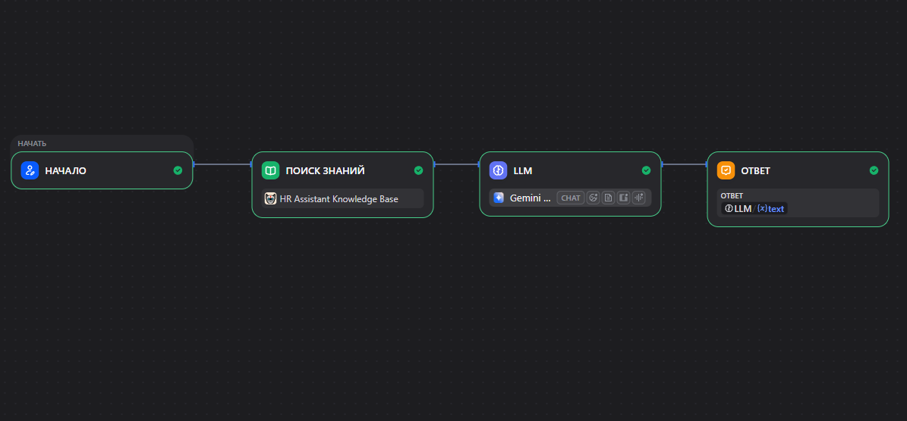

  

# Corporate HR RAG Assistant — Project Journey

 

## 1. Постановка задачи

 

**Цель:**

 

Создать AI-ассистента, который отвечает сотрудникам на вопросы по внутренним регламентам компании.

 

Сценарий:

 <p align="center">
  
</p>


---

 

# 2. Архитектурное решение

 

Добавляешь:

 

-  C4 Context Diagram; 
-  RAG Architecture. 

 

Скрин:


```javascript
Documents

↓

Chunking

↓

Embeddings

↓

Vector DB

↓

Retriever

↓

LLM
```

 

---

 

# 3. Подготовка базы знаний

 

Показываешь:

 

### Исходный документ

 

Например:

 

```javascript
Reglament_Komandirovki.pdf
16 страниц
```

 

↓

 

### Проблема

 


```javascript
416 маленьких чанков
```

 

↓

 

### Анализ

 

"Структура документа плохо подходит для семантического поиска"

 

↓

 

### Решение

 

Подготовлен AI-friendly промежуточный документ.

 

Скрин:

 

Dify Knowledge Base.

 

---

 

# 4. Оптимизация Chunking

 

Это вообще очень хороший раздел для интервью.

 

Показать:

 

Было:

 


```javascript
\n
1024
50

416 chunks
```

 

Проблема:

 


```javascript
Лимит гостиницы
```

 

искался отдельно от:

 


```javascript
Ответ:
150 USD
```

 

---

 

Стало:


```javascript
\n\n
500
100

14 chunks
```

 

Результат:

 


```javascript
Вопрос → правильный контекст → правильный ответ
```

 

---

 

# 5. Metadata Design

 

Очень хороший инженерный раздел.

 

Показываешь:

 


```javascript
Document:

Business Travel

Metadata:

department = HR
document_type = regulation
topic = travel
```

 

И объясняешь:

 

"Метаданные позволяют масштабировать решение при добавлении десятков документов."

 

---

 

# 6. Workflow Implementation

 

Скрин Dify:

 <p align="center">
  
</p>


 

---

 

# 7. Testing

 

Таблица:

 

| Вопрос | Результат |
|----|----|
| Лимит гостиницы за рубежом | ✅ |
| Кто согласует 100 000 рублей | ✅ |
| Класс авиабилетов | ✅ |
| Нет данных в базе | ✅ HR |

 

---

 

# 8. Итоговая версия

 

Скрин:

 

Опубликованный Dify App.

  
