# Corporate HR RAG Assistant — Project Journey

## 1. Постановка задачи

**Цель:** создать AI-ассистента, который отвечает сотрудникам на вопросы по внутренним регламентам компании.

  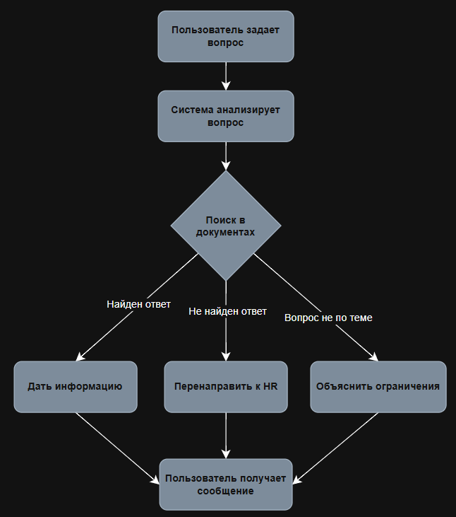

---

## 2. Архитектурное решение

### Container Diagram (C4)

Диаграмма контейнеров (C4 Container Diagram) для проекта выглядит следующим образом:

  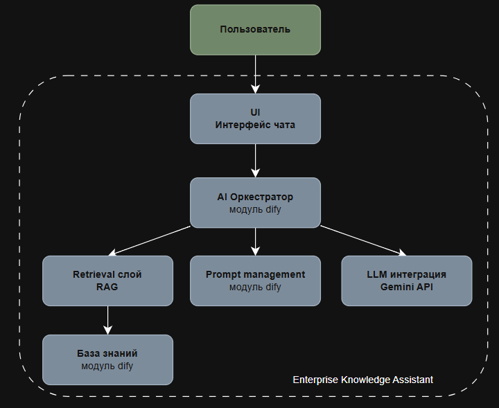

### RAG-архитектура

Архитектура RAG представлена на горизонтальной блок-схеме (pipeline):

  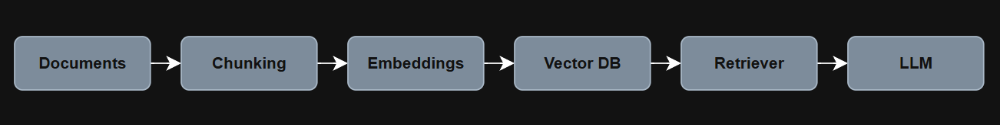

---

## 3. Реализация Workflow

Скриншот интерфейса Dify:

  

---

## 4. Подготовка базы знаний

При загрузке документов были опробованы различные методики сегментирования, и для каждого типа документа (PDF, TXT) выбрана оптимальная.

  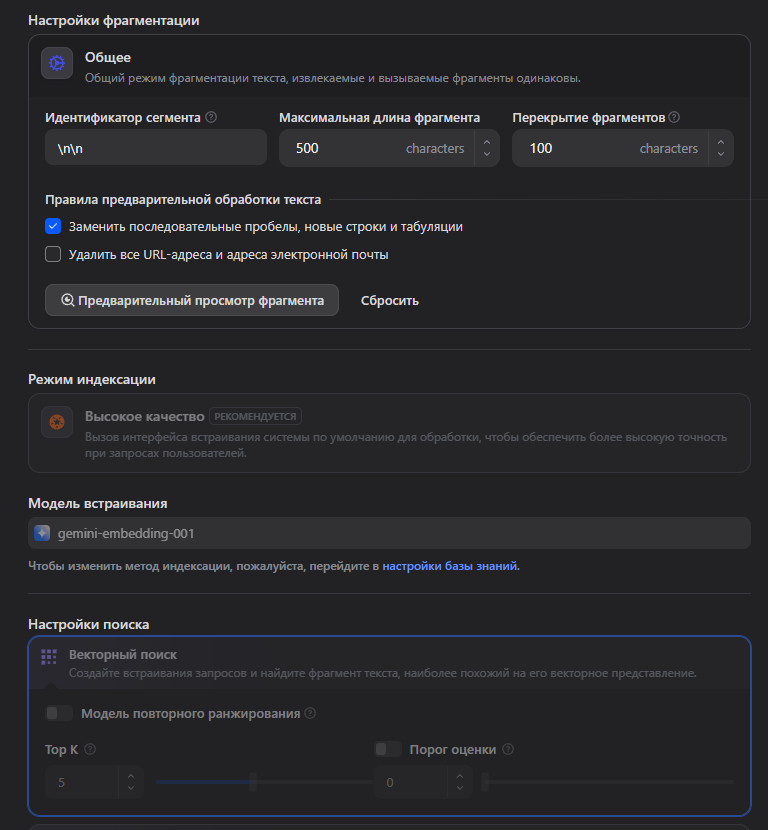

Документы прошли через процессы chunking и embedding, после чего данные были помещены в векторную базу данных (Vector DB). Ниже — список загруженных и обработанных документов.

  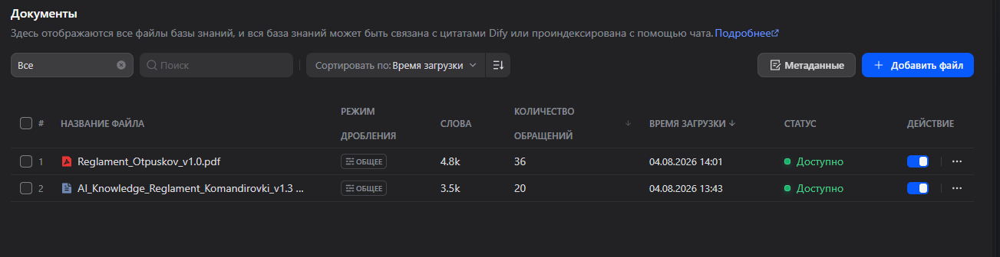

После загрузки и обработки работа с каждым документом была протестирована, а получаемые chunks — проанализированы. Процесс повторялся до тех пор, пока результат не стал удовлетворять начальным условиям проекта.

  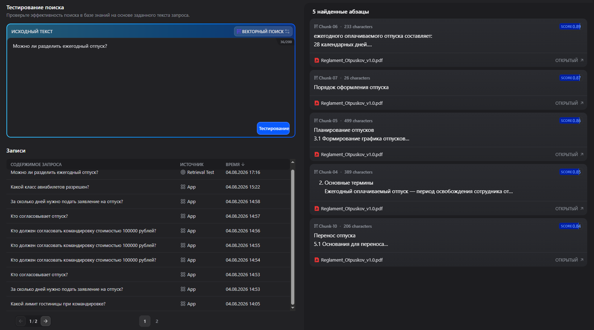

Для работы с различными сценариями и для будущего масштабирования системы были созданы и определены метаданные для каждого документа.

  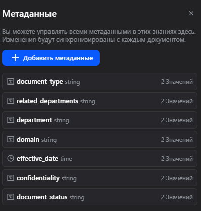

  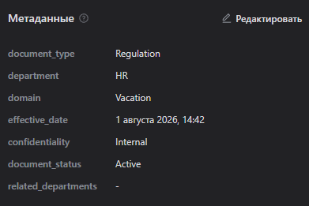

В качестве LLM был выбран Gemini 3.6 Flash.

  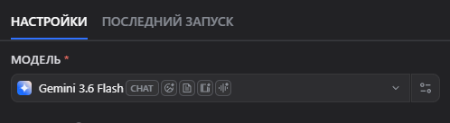

В LLM были прописаны системный промпт и определены основные переменные.

  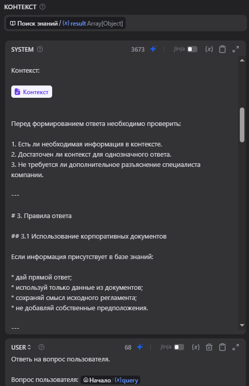

Для объяснения назначения чата было заполнено приветственное сообщение и добавлены примеры вопросов.

  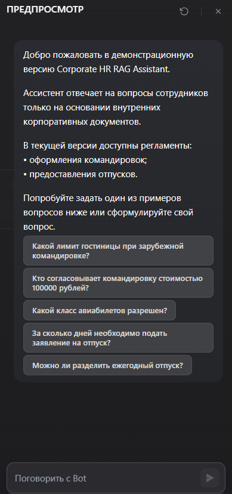

---

## 5. Тестирование

Система была протестирована по основным сценариям:

| Вопрос | Результат |
|---|---|
| Лимит гостиницы за рубежом | ✅ |
| Кто согласует 100 000 рублей | ✅ |
| Класс авиабилетов | ✅ |
| Нет данных в базе | ✅ (переадресация в HR) |

Поведение системы при вопросе, информацию по которому можно найти в прилагаемых документах:

  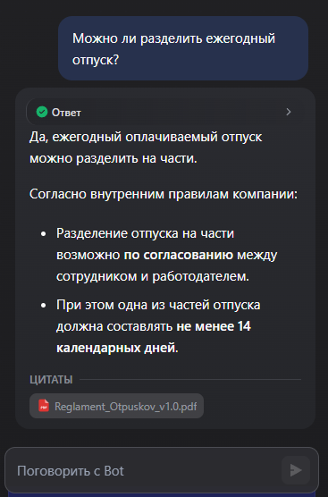

Поведение системы при вопросе, выходящем за рамки её компетенции 

  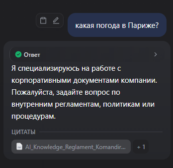

TODO например: «Какой лимит компенсации обучения сотрудника в университете?»

**Лимит сообщений.** Поскольку использовалась бесплатная версия API, она ограничена по количеству запросов в сутки. При достижении лимита в чате появляется соответствующее сообщение:

  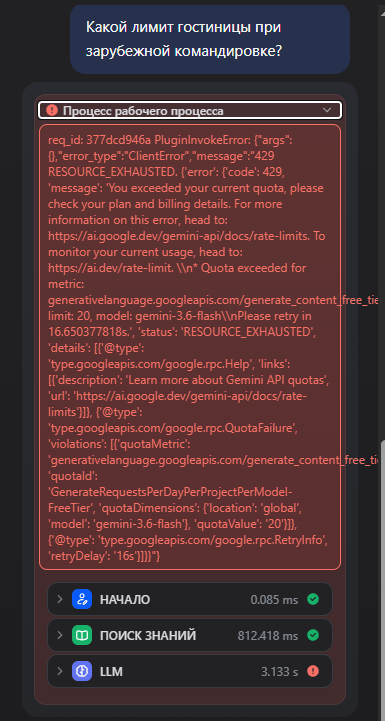

---

## 6. Итоговая версия

Опубликованное приложение в Dify.
