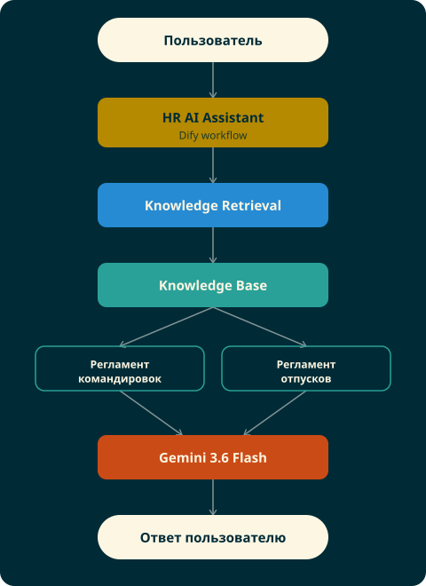

<div align="center">

# 🤖 Corporate HR RAG Assistant

### Корпоративный AI-ассистент для работы с внутренними регламентами


</div>

---

> ⚠️ **Обратите внимание**
>
> Онлайн-демо использует **бесплатный** API Google Gemini, у которого есть лимит запросов в сутки и в минуту. Если во время тестирования сервис недоступен или возвращает ошибку `429 RESOURCE_EXHAUSTED` — это ограничение бесплатного тарифа, а не сбой проекта.
>
> 📂 Исходный код, архитектурная документация, тестовые сценарии и материалы по проектированию **всегда доступны в этом репозитории**, независимо от состояния онлайн-демо.
> 
> 📄 Примечание: Если онлайн-демо временно недоступно из-за исчерпания квоты бесплатного API, пожалуйста, ознакомьтесь со скриншотами, архитектурными схемами и результатами тестирования, представленными в репозитории. Они отражают работу проекта и его функциональные возможности.

---

## 📖 Содержание

- [О проекте](#-о-проекте)
- [Бизнес-задача](#-бизнес-задача)
- [Архитектура решения](#️-архитектура-решения)
- [Основные возможности](#-основные-возможности)
- [Используемые технологии](#-используемые-технологии)
- [База знаний](#-база-знаний)
- [Что было реализовано](#-что-было-реализовано)
- [Примеры вопросов](#-примеры-вопросов)
- [Структура репозитория](#-структура-репозитория)
- [Документация проекта](#-документация-проекта)
- [Полученные практические навыки](#-полученные-практические-навыки)
- [Возможные направления развития](#-возможные-направления-развития)
- [Лицензия](#-лицензия)

---

## 💡 О проекте

**Corporate HR RAG Assistant** — демонстрационный проект корпоративного AI-ассистента, построенного на архитектуре **Retrieval-Augmented Generation (RAG)**.

Ассистент отвечает на вопросы сотрудников **исключительно на основе внутренних нормативных документов компании**, а не за счёт общих знаний языковой модели.

Проект моделирует типичный корпоративный сценарий: сотруднику нужно быстро найти ответ в регламентах, инструкциях и внутренних политиках компании — без чтения документа целиком.

---

## 🎯 Бизнес-задача

В крупных компаниях внутренние регламенты могут занимать сотни и тысячи страниц.

Поиск информации традиционными средствами занимает много времени и часто возвращает **целый документ вместо конкретного ответа**.

Например, сотруднику нужно быстро узнать:

- какой лимит гостиницы предусмотрен при зарубежной командировке;
- кто должен согласовать командировку стоимостью 100 000 рублей;
- за сколько дней нужно подать заявление на отпуск;
- можно ли разделить ежегодный отпуск на несколько частей.

**Цель проекта** — показать, как RAG позволяет находить только релевантные фрагменты документов и формировать точный ответ на их основе, а не отдавать пользователю весь регламент.

---

## 🏗️ Архитектура решения

Проект реализован по классической архитектуре Enterprise RAG.

<p align="center">
  
</p>

---

## ⚙️ Основные возможности

- корпоративная RAG-архитектура
- работа с несколькими документами одновременно
- векторный поиск по корпоративной документации
- настройка и оптимизация Chunking
- Prompt Engineering
- фильтрация документов по метаданным
- защита от галлюцинаций модели
- тестирование качества Retrieval
- проектная документация и архитектурные схемы

---

## 🛠️ Используемые технологии

| Технология | Назначение |
|---|---|
| **Dify** | Платформа для построения AI Workflow |
| **Gemini 3.6 Flash** | Большая языковая модель |
| **Gemini Embeddings** | Векторизация документов |
| **Knowledge Base** | Хранение корпоративных документов |
| **Vector Database** | Семантический поиск |
| **Git** | Контроль версий |

---

## 📚 База знаний

В текущей версии проекта используются два документа — специально в разных форматах, чтобы продемонстрировать работу RAG с разнородными источниками.

| Документ | Формат |
|---|---|
| 📝 Регламент оформления командировок | `TXT` |
| 📕 Регламент предоставления отпусков | `PDF` |

---

## 🔨 Что было реализовано

Во время разработки были решены практические задачи, типичные для корпоративных AI-систем:

- подготовка документов для RAG
- исследование влияния разных стратегий Chunking
- сравнение качества обработки PDF и TXT
- настройка Retrieval
- проектирование модели метаданных
- фильтрация документов по метаданным
- функциональное тестирование системы

---

## 💬 Примеры вопросов

<table>
<tr>
<td valign="top" width="50%">

### ✈️ Командировки

- Какой лимит гостиницы предусмотрен при зарубежной командировке?
- Кто должен согласовать командировку стоимостью 100 000 рублей?
- Какой класс авиабилетов разрешён?

</td>
<td valign="top" width="50%">

### 🌴 Отпуска

- Сколько дней ежегодного отпуска положено сотруднику?
- За сколько дней нужно подать заявление на отпуск?
- Можно ли разделить отпуск на несколько частей?

</td>
</tr>
</table>

> 📌 *Здесь появится скриншот диалога с успешным ответом ассистента.*

---

## 📁 Структура репозитория

```
docs/
    architecture/
    testing/
    project/

knowledge/

screenshots/

README.md
```

---

## 📄 Документация проекта

В репозитории представлены основные проектные документы:

- Project Charter
- C4 Context Diagram
- RAG Architecture & Data Flow
- Prompt Design
- Metadata Model
- Test Report

Это показывает, что проект создавался как **полноценное инженерное решение**, а не только как демонстрация возможностей AI.

---

## 🎓 Полученные практические навыки

- проектирование Enterprise RAG-архитектуры
- подготовка корпоративной базы знаний
- проектирование стратегии Chunking
- работа с векторным поиском
- Prompt Engineering
- проектирование метаданных
- тестирование Retrieval
- разработка AI Workflow в Dify

---

## 🚀 Возможные направления развития

В следующих версиях проекта планируется добавить:

- Tool Calling
- интеграцию с ERP-системой
- SQL-запросы к базе данных
- разграничение прав доступа к документам
- Multi-Agent архитектуру
- Hybrid Search
- автоматизированную оценку качества ответов (Evaluation Framework)

---

## 📜 Лицензия

Учебный проект, разработанный в рамках формирования портфолио по проектированию корпоративных AI-решений.

<div align="center">

---

Сделано с ❤️ и 🤖 для изучения AI-инженерии

</div>
