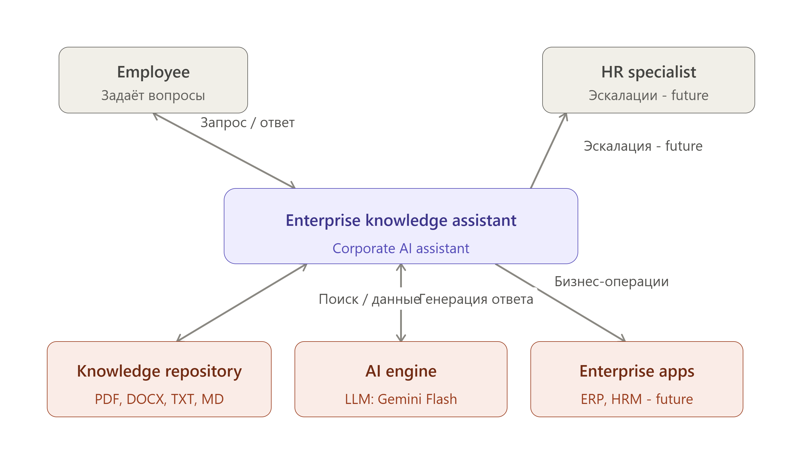

  

# Enterprise Knowledge Assistant

 

**Версия:** 0.1


 **Статус:** Draft


 **Дата:** 03.08.2026


 **Документ:** System Context Diagram (C4 Level 1)


 **Связанные документы:**

 

-  Паспорт проекта v0.1 
-  Концепция продукта v0.1 
-  Use Cases v0.1  

---

 

## 1. Назначение документа 

Настоящий документ описывает **контекст системы Enterprise Knowledge Assistant** на уровне C4 Model Level 1 (System Context Diagram). 

Диаграмма показывает: 

-  границы создаваемой системы; 
-  пользователей системы; 
-  внешние системы; 
-  основные направления взаимодействия. 

 

Документ отвечает на архитектурный вопрос: 

> "Как Enterprise Knowledge Assistant существует в экосистеме компании?" 

---

 

## 2. Архитектурный подход 

Для описания системы используется модель **C4 Model**.

 

Уровни C4: 

| Уровень | Назначение |
|----|----|
| Level 1 — System Context | Показывает систему в окружении |
| Level 2 — Container | Показывает внутренние компоненты системы |
| Level 3 — Component | Показывает внутренние модули компонентов |
| Level 4 — Code | Уровень реализации |

 

Текущий документ описывает только: 

> **Level 1 — System Context** 

---

 

## 3. Границы системы 

**Система в рамках проекта**

 

**Enterprise Knowledge Assistant** 

AI-powered корпоративный ассистент, предназначенный для предоставления сотрудникам доступа к корпоративным знаниям через естественный язык. 

---

 

### Что находится внутри системы

 

В рамках текущего архитектурного уровня: 

-  AI Orchestration Layer; 
-  обработка пользовательских запросов; 
-  управление контекстом диалога; 
-  взаимодействие с AI Engine; 
-  работа с источниками знаний.  

---

 

### Что находится вне системы 

Внешними системами являются: 

-  пользователи; 
-  корпоративные документы; 
-  поставщик AI-модели; 
-  будущие корпоративные системы.  

---

 

## 4. System Context Diagram

 

### Логическая схема

```javascript
                          Международная производственная компания


        ┌─────────────────────┐
        │                     │
        │     Employee        │
        │    Сотрудник        │
        │                     │
        └──────────┬──────────┘
                   │
                   │
                   │ Вопросы,
                   │ запросы,
                   │ уточнения
                   ▼


        ┌─────────────────────────────────────┐
        │                                     │
        │   Enterprise Knowledge Assistant    │
        │                                     │
        │  AI корпоративный ассистент         │
        │                                     │
        └──────────────┬──────────────────────┘
                       │
                       │
        ┌──────────────┼───────────────┐
        │              │               │
        ▼              ▼               ▼


┌──────────────┐ ┌──────────────┐ ┌──────────────────┐
│ Corporate    │ │ AI Engine    │ │ Enterprise       │
│ Knowledge    │ │              │ │ Applications     │
│ Repository   │ │              │ │ (Future)         │
│              │ │              │ │                  │
│ PDF          │ │ LLM Provider │ │ ERP              │
│ DOCX         │ │ Gemini       │ │ HRM              │
│ TXT          │ │              │ │ Fleet System     │
│ MD           │ │              │ │ Service Desk     │
└──────────────┘ └──────────────┘ └──────────────────┘


                       ▲
                       │
                       │
              ┌────────┴────────┐
              │ HR Specialist   │
              │ (Future)        │
              └─────────────────┘
```

 

---

 

## 5. Описание элементов системы

 

### 5.1 Employee

 

#### Тип 

Person 

---

 

#### Описание 

Сотрудник международной производственной компании, использующий AI-ассистента для получения информации из корпоративных регламентов. 

---

 

#### Использование

Основные сценарии: 

-  поиск информации; 
-  получение объяснения правил; 
-  уточнение требований документов.  

---

 

#### Примеры запросов

 

> Какой лимит гостиницы при зарубежной командировке?

 

> Требуется ли согласование закупки на 300 000 рублей? 

---

 

### 5.2 Enterprise Knowledge Assistant

 

#### Тип

 

Software System 

---

 

#### Назначение

 

Центральная система проекта. 

Предоставляет единый интерфейс взаимодействия сотрудников с корпоративными знаниями. 

---

 

#### Основные функции

 

-  прием пользовательских запросов; 
-  анализ намерения пользователя; 
-  получение релевантной информации; 
-  формирование ответа; 
-  применение AI-ограничений.  

---

 

#### Не выполняет 

-  принятие управленческих решений; 
-  изменение данных в корпоративных системах; 
-  выполнение критичных операций.  

---

 

### 5.3 Corporate Knowledge Repository

 

#### Тип

 

External System / Data Source 

---

 

#### Назначение 

Источник корпоративной информации. 

---

 

#### Содержимое

 

На MVP:

```javascript
Reglament_Komandirovki.pdf

Reglament_Zakupok.pdf
```

 

Будущее: 

-  HR policies; 
-  инструкции; 
-  стандарты; 
-  производственные регламенты.  

---

 

#### Взаимодействие

 

Enterprise Knowledge Assistant: 

-  выполняет поиск; 
-  получает релевантные фрагменты документов.  

---

 

### 5.4 AI Engine

 

#### Тип

 

External System

---

 

#### Назначение

 

Предоставление возможностей генеративного искусственного интеллекта. 

---

 

#### Реализация MVP

 

Используется: 

-  Gemini Flash через API.  

---

 

#### Ответственность

 

AI Engine выполняет: 

-  понимание естественного языка; 
-  генерацию ответа; 
-  преобразование найденного контекста в понятную форму.  

---

 

#### Ограничение

 

AI Engine: 

❌ не является источником корпоративных знаний; 

❌ не должен самостоятельно создавать правила; 

❌ не имеет права принимать бизнес-решения.

---

 

### 5.5 Enterprise Applications

 

#### Тип

 

External Systems 

---

 

#### Статус

 

Future Capability 

---

 

#### Возможные интеграции

 

#### ERP

 

Пример: 

-  получение статуса заявок; 
-  выполнение бизнес-операций.  

---

 

#### HR System

 

Пример: 

-  передача обращений; 
-  получение данных сотрудников.  

---

 

#### Fleet Management

 

Пример: 

-  просмотр корпоративных автомобилей; 
-  бронирование автомобилей.  

---

 

### 5.6 HR Specialist

 

#### Тип

 

Person 

---

 

#### Статус

 

Future Capability 

---

 

#### Использование

 

Получает обращения, которые: 

-  требуют человеческого решения; 
-  имеют юридический или конфликтный характер; 
-  выходят за пределы AI-компетенции.  

---

 

## 6. Основные взаимодействия 

| Источник | Получатель | Описание |
|----|----|----|
| Employee | Enterprise Knowledge Assistant | Пользовательский запрос |
| Enterprise Knowledge Assistant | Employee | Ответ AI |
| Assistant | Knowledge Repository | Поиск документов |
| Knowledge Repository | Assistant | Релевантные данные |
| Assistant | AI Engine | Запрос генерации ответа |
| AI Engine | Assistant | Сгенерированный ответ |
| Assistant | HR Specialist | Эскалация обращения (Future) |
| Assistant | Enterprise Applications | Бизнес-операции (Future) |

 

---

 

## 7. Архитектурные решения

 

---

 

### ADR-001

 

AI Assistant выделяется как отдельная система

 

#### Решение 

AI-функциональность реализуется отдельным системным слоем. 

---

 

#### Обоснование

 

Позволяет: 

-  менять LLM-провайдера; 
-  добавлять новые источники знаний; 
-  интегрировать корпоративные системы; 
-  контролировать безопасность.  

---

 

### ADR-002

 

AI Engine не является владельцем бизнес-логики

 

#### Решение 

Бизнес-правила остаются в корпоративных системах и документах.

---

 

#### Обоснование

 

LLM может: 

-  интерпретировать запрос; 
-  формировать ответ. 

 

Но не должна: 

-  самостоятельно определять правила; 
-  изменять данные; 
-  выполнять операции без контроля.  

---

 

### ADR-003

 

Knowledge Repository является источником истины

 

#### Решение

 

Ответы должны основываться только на утвержденных корпоративных документах. 

---

 

#### Обоснование

 

Снижение риска: 

-  галлюцинаций; 
-  неверных рекомендаций; 
-  неправильной интерпретации политики компании.  

---

 

## 8. Архитектурные последствия

 

Создание данной архитектуры приводит к следующим требованиям:

 

#### Требование 1

 

Необходимо разделение: 

```javascript
Knowledge Layer

        +

AI Reasoning Layer

        +

Business Systems Layer
```

 

---

 

#### Требование 2

 

Добавление новых функций должно происходить через расширение системы:

 

Пример: 

```javascript
HR Assistant

Fleet Assistant

ERP Assistant

Procurement Assistant
```

 

не должны создавать отдельные AI-чаты. 

---

 

#### Требование 3

 

Будущие операции с корпоративными данными должны выполняться через API.

 

Прямой доступ LLM к БД запрещается. 

---

 

## 9. PlantUML код диаграммы

 

Файл:

docs/02_Solution_Design/diagrams/c4_context.puml

  

Содержимое: 

```javascript
@startuml Enterprise_Knowledge_Assistant_C4_Context_Flows
!include https://raw.githubusercontent.com/plantuml-stdlib/C4-PlantUML/master/C4_Context.puml

title Enterprise Knowledge Assistant - System Context Diagram (Request/Response flows)

Person(employee, "Employee", "Company employee using AI assistant")
System(assistant, "Enterprise Knowledge Assistant", "AI-powered corporate knowledge assistant")
System_Ext(knowledge, "Knowledge Repository", "Corporate documents: PDF, DOCX, TXT, MD")
System_Ext(aiEngine, "AI Engine", "LLM provider: Gemini Flash")
Person(hr, "HR Specialist", "Handles escalated requests - Future")
System_Ext(enterprise, "Enterprise Applications", "ERP, HRM, Fleet Management - Future")

Rel(employee, assistant, "Пользовательский запрос")
Rel(assistant, employee, "Ответ AI")

Rel(assistant, knowledge, "Поиск документов")
Rel(knowledge, assistant, "Релевантные данные")

Rel(assistant, aiEngine, "Запрос генерации ответа")
Rel(aiEngine, assistant, "Сгенерированный ответ")

Rel(assistant, hr, "Эскалация обращения - Future")
Rel(assistant, enterprise, "Бизнес-операции - Future")

@enduml
```

 

  
