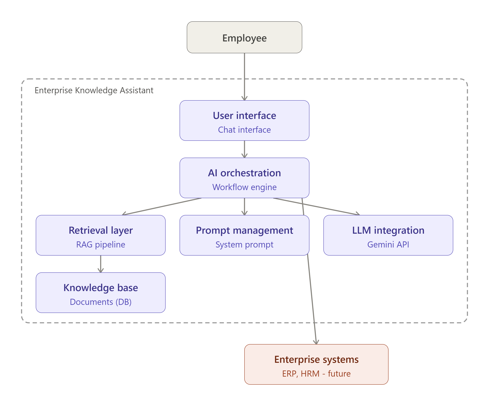

# Enterprise Knowledge Assistant

 

**Версия:** 0.1


**Статус:** Draft


**Дата:** 03.08.2026


**Документ:** Container Diagram (C4 Level 2)


**Связанные документы:**


- Паспорт проекта v0.1
- Концепция продукта v0.1
- Use Cases v0.1  
- System Context Diagram  v0.1 

 

---

 

## 1. Назначение документа 

Настоящий документ описывает внутреннюю структуру системы **Enterprise Knowledge Assistant** на уровне C4 Model Level 2 (Container Diagram). 

Документ отвечает на вопрос: 

> "Из каких основных архитектурных компонентов состоит AI-ассистент и как они взаимодействуют?" 

## 2. Архитектурный подход 

В рамках проекта применяется принцип разделения ответственности:

```javascript
User Interaction

        +

AI Orchestration

        +

Knowledge Retrieval

        +

LLM Processing

        +

External Integration
```

 

---

 

Основной архитектурный принцип: 

> LLM является компонентом интеллектуальной обработки языка, но не является владельцем бизнес-логики и корпоративных данных. 

---

 

## 3. Общая архитектура системы 

```javascript
                         Employee

                            |
                            |
                            ▼


              +--------------------------------+
              | Enterprise Knowledge Assistant |
              +--------------------------------+

                            |
                            ▼


              +--------------------------------+
              | 1. User Interface Layer        |
              |                                |
              | Chat Interface                 |
              +--------------------------------+

                            |
                            ▼


              +--------------------------------+
              | 2. AI Orchestration Layer      |
              |                                |
              | Request processing             |
              | Workflow management            |
              | Context handling               |
              +--------------------------------+

                    /                  \

                   /                    \


                  ▼                      ▼


      +----------------------+     +----------------------+
      | 3. Knowledge         |     | 4. Prompt Management |
      | Retrieval Layer      |     | Layer                |
      |                      |     |                      |
      | RAG Pipeline         |     | System Instructions  |
      | Search               |     | Guardrails           |
      +----------------------+     +----------------------+

                    |
                    |
                    ▼


          +----------------------+
          | 5. Knowledge Base    |
          |                      |
          | Corporate Documents |
          +----------------------+


                   

              AI Orchestration Layer

                            |

                            ▼


              +----------------------+
              | 6. LLM Integration   |
              | Layer                |
              |                      |
              | Gemini API           |
              +----------------------+


                           

              Future Extensions


                            |

                            ▼


              +----------------------+
              | 7. Business          |
              | Integration Layer    |
              |                      |
              | ERP                  |
              | HRM                  |
              | Fleet Systems        |
              +----------------------+
```

 

---

 

## 4. Описание контейнеров 

### Container 1

 

User Interface Layer 

#### Назначение 

Предоставляет пользовательский интерфейс взаимодействия с AI-ассистентом. 

---

 

#### Реализация MVP 

Dify Chat Interface. 

---

 

#### Ответственность

 

Компонент отвечает за: 

-  получение пользовательских сообщений; 
-  отображение ответов; 
-  управление пользовательской сессией. 

---

 

#### Не отвечает за: 

❌ поиск информации; 

❌ генерацию ответа; 

❌ бизнес-логику. 

---

 

### Container 2

 

AI Orchestration Layer 

#### Назначение

 

Центральный управляющий слой AI-системы. 

---

 

#### Реализация MVP 

Dify Workflow Engine. 

---

 

#### Ответственность

 

Компонент управляет: 

-  последовательностью обработки запроса; 
-  вызовом RAG; 
-  передачей контекста LLM; 
-  обработкой результата; 
-  будущими Tool Calls.  

---

 

#### Пример обработки 

```javascript
User Question

↓

Intent Detection

↓

Knowledge Search

↓

Context Assembly

↓

LLM Request

↓

Response
```

 

---

 

### Container 3

 

Knowledge Retrieval Layer 

#### Назначение 

Обеспечивает поиск информации в корпоративных знаниях. 

---

 

#### Основные функции 

-  обработка документов; 
-  разбиение текста на chunks; 
-  создание embeddings; 
-  semantic search; 
-  передача найденного контекста.  

---

 

#### Реализация MVP 

Dify Knowledge Retrieval. 

---

 

#### Пример

 

Запрос: 

> Какой лимит гостиницы в зарубежной командировке?

 

Результат:

```javascript
Document:
Reglament_Komandirovki.pdf

Chunk:
2.2 Лимит составляет 150 USD в сутки
```

 

---

 

### Container 4

 

Prompt Management Layer 

#### Назначение 

Управление поведением AI-модели. 

---

 

#### Ответственность

 

Хранит: 

-  System Prompt; 
-  правила поведения; 
-  ограничения; 
-  форматирование ответов.  

---

 

#### Пример правил

```javascript
Отвечай только на основе корпоративных документов.

Не выдумывай информацию.

Если данных нет:
сообщи об отсутствии информации.
```

 

---

 

#### Будущее развитие

 

Возможность разделения:

```javascript
System Prompt

+

Domain Prompts

+

Safety Rules
```

 

---

 

### Container 5

 

Knowledge Base 

#### Назначение 

Хранилище корпоративных знаний. 

---

 

#### Форматы MVP 

Поддерживаемые документы: 

-  PDF; 
-  DOCX; 
-  TXT; 
-  Markdown.  

---

 

#### Примеры документов

```javascript
Reglament_Komandirovki.pdf

Reglament_Zakupok.pdf
```

 

---

 

#### Принцип

 

Knowledge Base является: 

> Single Source of Truth для ответов AI. 

---

 

### Container 6

 

LLM Integration Layer 

#### Назначение 

Абстракция взаимодействия с языковой моделью. 

---

 

#### Реализация MVP 

Gemini 3.6 Flash API. 

---

 

#### Ответственность 

-  передача запроса; 
-  получение ответа модели; 
-  обработка генерации текста.  

---

 

#### Ограничения 

LLM: 

❌ не хранит корпоративные правила; 

❌ не выполняет операции; 

❌ не имеет прямого доступа к БД. 

---

 

### Container 7

 

Business Integration Layer 

#### Статус 

Future Capability. 

---

 

#### Назначение 

Интеграция с корпоративными системами. 

---

 

#### Возможные системы

 

**ERP** 

Примеры: 

-  статус заявки; 
-  данные процессов. 

 

---

 

**HR System** 

Примеры: 

-  обращения; 
-  данные сотрудников. 

 

---

 

**Fleet Management**

 

Пример: 

Запрос: 

> Забронировать автомобиль.

 

Поток:

```javascript
AI

↓

Fleet API

↓

Database

↓

Reservation
```

 

---

 

## 5. Поток обработки запроса MVP

 

Пример:

 

Пользователь: 

> Какие суточные предусмотрены при зарубежной командировке?

```javascript
1. User Interface

↓

2. AI Orchestration

↓

3. Knowledge Retrieval

↓

4. Найден документ

Reglament_Komandirovki.pdf

↓

5. Prompt Layer добавляет правила

↓

6. LLM формирует ответ

↓

7. User получает результат
```

 

---

 

## 6. Архитектурные решения

 

---

 

### ADR-004 

Использование логической архитектуры вместо привязки к платформе

 

#### Решение 

Архитектура описывается независимо от конкретного AI-инструмента. 

---

 

#### Обоснование 

Позволяет: 

-  заменить Dify; 
-  использовать другую AI Platform; 
-  масштабировать решение. 
-  

---

 

### ADR-005 

Выделение AI Orchestration Layer

 

#### Решение 

Логика взаимодействия компонентов не должна находиться внутри LLM. 

---

 

#### Обоснование 

Обеспечивает: 

-  контроль поведения; 
-  безопасность; 
-  тестируемость.  

---

 

### ADR-006 

Разделение Knowledge Layer и AI Layer

 

#### Решение 

Корпоративные знания хранятся отдельно от модели. 

---

 

#### Обоснование 

Позволяет: 

-  обновлять документы без переобучения модели; 
-  использовать разные LLM; 
-  контролировать источники ответов.  

---

 

## 7. Архитектурные последствия 

После реализации данной архитектуры:

 

### Возможность расширения RAG

 

Добавление новых областей: 

```javascript
HR Policies

↓

Procurement

↓

Manufacturing Instructions

↓

Safety Regulations
```

 

---

 

### Возможность подключения Tools 

Архитектура готова к: 

```javascript
User

↓

AI Orchestration

↓

Tool Calling

↓

External API
```

 

---

 

### Возможность перехода к Agent Architecture 

Будущая модель: 

```javascript
AI Assistant

├── Knowledge Agent

├── HR Agent

├── Procurement Agent

└── ERP Agent
```

 

---

 

## 8. Реализация MVP 

| Архитектурный слой | MVP реализация |
|----|----|
| User Interface | Dify Chat Interface |
| AI Orchestration | Dify Workflow |
| Knowledge Retrieval | Dify Knowledge Base |
| Prompt Layer | Dify System Prompt |
| Knowledge Base | PDF/DOCX/TXT/MD документы |
| LLM Integration | Gemini 3.6 Flash API |
| Business Integration | Не реализовано |

 

---

 

## 9. PlantUML код

 

Файл: 

```javascript
docs/02_Solution_Design/diagrams/c4_container.puml
```

   

Код: 

```javascript
@startuml Enterprise Knowledge Assistant - Container

!include <C4/C4_Container>

title Enterprise Knowledge Assistant - Container Diagram


Person(user, "Employee")

System_Boundary(system, "Enterprise Knowledge Assistant") {

Container(ui, "User Interface Layer",
"Chat Interface",
"User interaction")

Container(orchestrator, "AI Orchestration Layer",
"Workflow Engine",
"Controls AI workflow")

Container(rag, "Knowledge Retrieval Layer",
"RAG Pipeline",
"Searches corporate knowledge")

Container(prompt, "Prompt Management Layer",
"System Prompt",
"Controls AI behavior")

ContainerDb(kb, "Knowledge Base",
"Documents",
"Corporate regulations")

Container(llm, "LLM Integration Layer",
"Gemini API",
"Generates responses")

}


System_Ext(erp, "Enterprise Systems",
"ERP, HRM, Fleet (Future)")


Rel(user, ui, "Asks questions")

Rel(ui, orchestrator, "Sends request")

Rel(orchestrator, rag, "Requests search")

Rel(rag, kb, "Searches documents")

Rel(orchestrator, prompt, "Applies rules")

Rel(orchestrator, llm, "Generates answer")

Rel(orchestrator, erp, "Future integration")


@enduml
```

 
   
